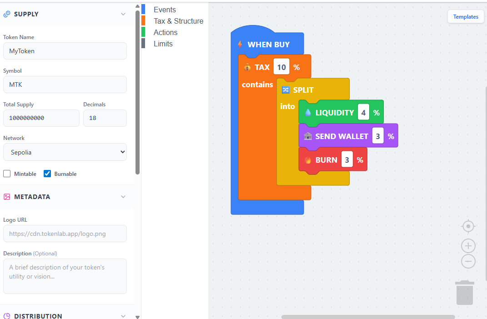
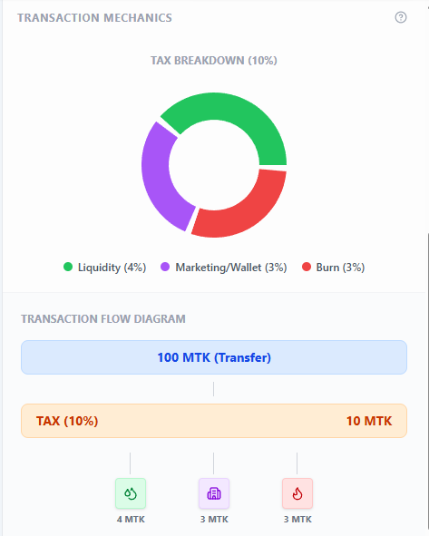
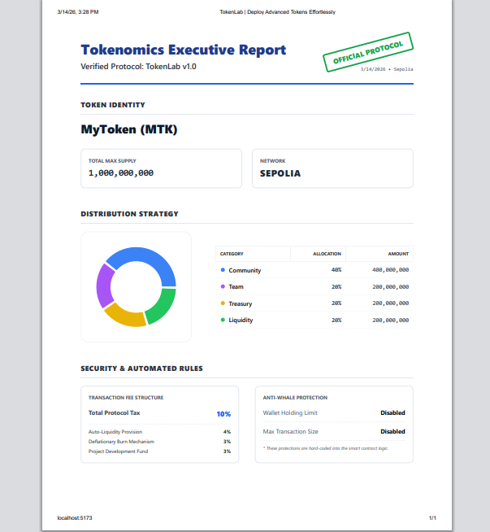
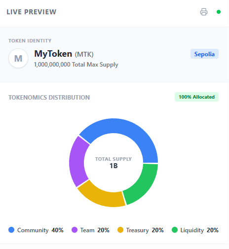

# TokenLab | Visual Tokenomics Builder 🚀


**TokenLab** is a premium, no-code platform that allows developers and innovators to design, simulate, and deploy advanced ERC-20 tokens through an intuitive visual interface. TokenLab brings "drag-and-drop" simplicity to complex smart contract engineering.

---

## ✨ Features

### 🧩 Visual Tokenomics Builder
Design your token economy using custom Blockly blocks. No Solidity coding required. Logic validation ensures your token is ship-ready and bug-free.

### 💰 Dynamic Tax Mechanics
Configure complex buy and sell taxes with basis-point precision. Automatically distribute fees to:
- **Auto-Liquidity**: Strengthen your pool with every trade.
- **Deflationary Burn**: Automatically decrease supply to increase scarcity.
- **Project Wallets**: Fund marketing and development via automated transfers.

### 🛡️ Anti-Whale Protection
Protect your community from market manipulation with customizable:
- **Max Wallet Limits**: Prevent whales from hoarding supply.
- **Max Transaction Limits**: Stop large dumps in a single trade.

### 📊 Real-time Analytics & Reporting
- **Interactive Visualization**: See your tax splits in real-time with dynamic charts.
- **Professional Reports**: Generate print-ready tokenomics reports for investors and documentation.

---

## 🛠️ Tech Stack

- **Frontend**: React 18, Vite, TypeScript, TailwindCSS
- **Visual Engine**: Google Blockly (Zelos Renderer)
- **Blockchain**: Solidity, OpenZeppelin v5.x, Hardhat
- **Interaction**: Wagmi, Viem, RainbowKit
- **Analytics**: Recharts, Lucide Icons

---

## 📸 Screenshots

| Workspace | Mechanics |
| :---: | :---: |
|  |  |

| Tokenomics | Live Preview |
| :---: | :---: |
|  |  |

---

## 📂 Project Structure

```text
.
├── contracts/               # Hardhat Project (Smart Contracts)
│   ├── contracts/           # TokenLab.sol & TokenFactory.sol
│   └── ignition/            # Deployment Modules
├── frontend/                # React Project (Visual Builder)
│   ├── src/blocks/          # Blockly definition & Generator logic
│   ├── src/components/      # UI Dashboard & Analytics
│   └── src/hooks/           # Web3 Deployment Orchestration
└── .antigravity/docs/       # Detailed Technical Documentation
```

---

## 🚀 Getting Started

### Prerequisites
- [Node.js](https://nodejs.org/) (v18+)
- [MetaMask](https://metamask.io/) or any Web3 wallet
- Sepolia Eth for testing

### Installation

1. **Clone the repository**
   ```bash
   git clone https://github.com/isonnymichael/token-lab.git
   cd token-lab
   ```

2. **Setup Frontend**
   ```bash
   cd frontend
   npm install
   npm run dev
   ```

3. **Setup Contracts (Optional)**
   ```bash
   cd contracts
   npm install
   npx hardhat compile
   ```

---

## 📜 Documentation

For more detailed technical insights, please refer to:
- [PROJECT_BRIEF.md](.antigravity/docs/PROJECT_BRIEF.md): Features, mechanics, and technical use cases.
- [PROJECT_STRUCTURE.md](.antigravity/docs/PROJECT_STRUCTURE.md): Architecture breakdown and data flow.

---

## 🎖️ Credits
Developed with ❤️ by isonnymichael. Empowering the next generation of decentralized economies.

**TokenLab - Deploy Advanced Tokens Effortlessly**
